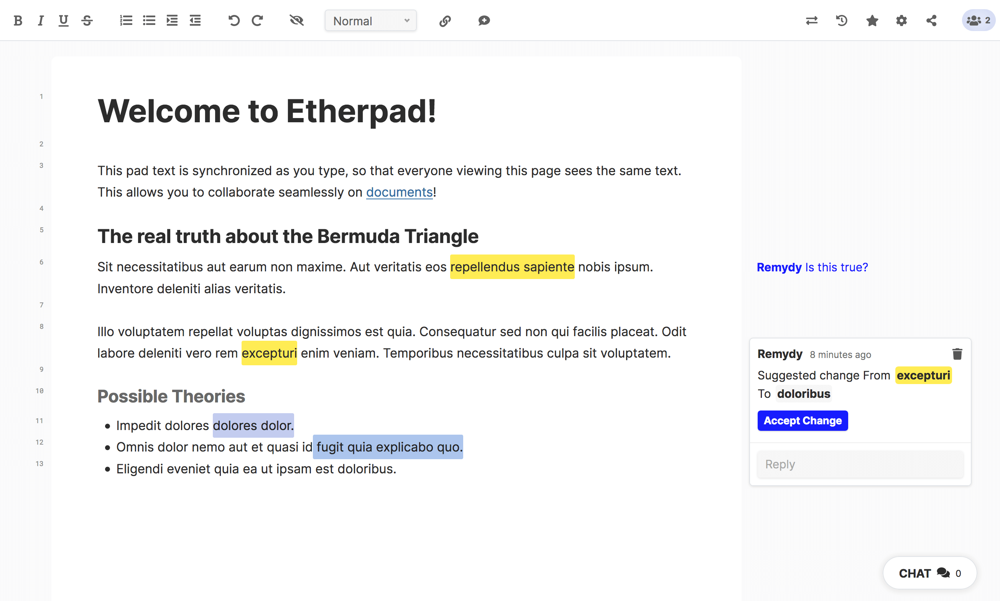

# Teapad: A clean, accessible skin for Etherpad-lite

## Features
* Easily editable via SASS variables
* Modified version of the official "Colibris" skin
* Crisp, modern, and easy to read
* Meets [level AA standards](https://www.w3.org/TR/WCAG21/#contrast-minimum) for color contrast
* Obeys ```prefers-reduced-motion``` user preference

## Screenshot


## Tested Plugin Compatibility
* [ep_comments_page](https://www.npmjs.com/package/ep_comments_page)
* [headings2](https://npmjs.org/package/ep_headings2)
* [embedded_hyperlinks2](https://npmjs.org/package/ep_embedded_hyperlinks2)

## How to Install
1. Download the dist "teapad" folder into ```src/static/skins/``` via FTP or another method.
2. Go to your configuration file (accessible either via web interface at ```https://example.com/admin/settings``` or in the root at ```settings.json```).
3. Find the ```"skinName"``` property and set it to ```"teapad"```

**Note:** This skin does not support Etherpad's Skin Variant Builder.
